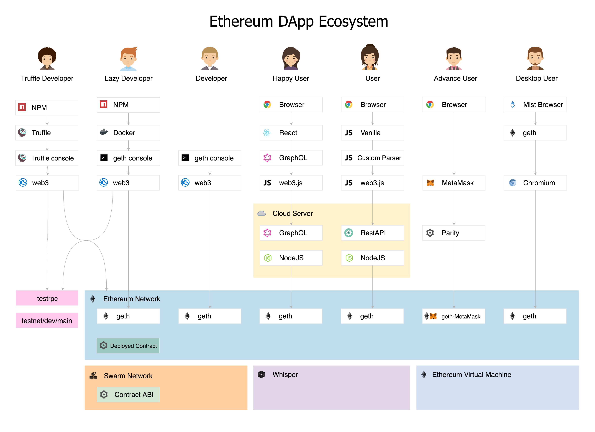

# hello-eth
⛓ An easiest way to enjoy Ethereum developments.

## Knowledge base
- [Blockchain](https://en.wikipedia.org/wiki/Blockchain) is a continuously growing list of records, called blocks, which are linked and secured using cryptography. Each block typically contains a hash pointer as a link to a previous block, a timestamp and transaction data. It enables digital currency named Bitcoin and Ethereum.
- [Bitcoin](https://en.wikipedia.org/wiki/Bitcoin) is a digital asset designed by its inventor, Satoshi Nakamoto, to work as a currency.
- [Ethereum](https://ethereum.org/) is a decentralized platform that runs smart contracts on a custom built Blockchain. It provides a cryptocurrency token called "ether" and enables the decentralized web3.
- [web3](http://ethdocs.org/en/latest/introduction/web3.html) is a platform for decentralized apps (dApps).
- [Dapps](http://www.ethereumwiki.com/ethereum-wiki/dapps/) is a Decentralized Applications on web3 which connect Frontend with Smart Contract on Blockchain.
- [MetaMask](https://metamask.io/) is a Dapps browsers as Chrome extension. Allows you to run Ethereum dApps right in your browser without running a full Ethereum node.
- [DAO](https://ethereum.org/dao) : Decentralized Autonomous Organization, 

## Developers
- [web3.js](https://github.com/ethereum/web3.js/) is the Ethereum compatible JavaScript API which implements the Generic JSON RPC spec. It's available on npm as a node module
- [Truffle](https://github.com/trufflesuite/truffle) is a NodeJS Framework for Ethereum, use for compile, deploy smart contract.
- [Solidity](http://solidity.readthedocs.io/en/latest/#solidity) is a contract-oriented, high-level language whose syntax is similar to that of JavaScript and it is designed to target the Ethereum Virtual Machine (EVM).
- ABI : Application Binary Interface, is basically how you call functions in a contract and get data back.
- IPC : Inter-process Communications, the mechanisms an operating system provides to allow the processes to manage shared data.
- RPC : Remote Procedure Calls, a kind of request–response protocol

## Examples
- [x] Setup : https://github.com/katopz/ethereum-docker
- [x] Simple : https://github.com/katopz/truffle-simple-storage-example
- [x] Advance : https://github.com/katopz/truffle-metacoin-example
- [x] CRUD : https://github.com/katopz/ethereum-todolist
- [x] Web3 : https://github.com/katopz/web3-react-example
- [x] GraphQL : https://github.com/katopz/ethereum-to-graphql

## Missing
- [ ] Advance Solidity language
- [ ] Design Pattern
- [ ] Package management // Truffle
- [ ] Debug? // Bug!
- [ ] Deploy to other network? // Slow!
- [ ] Oracle? // Later!

## TODO
- [x] Blockchain landscape.
- [ ] Blockchain visualization.
